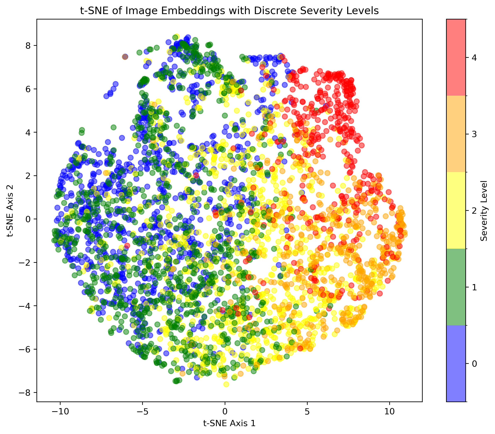
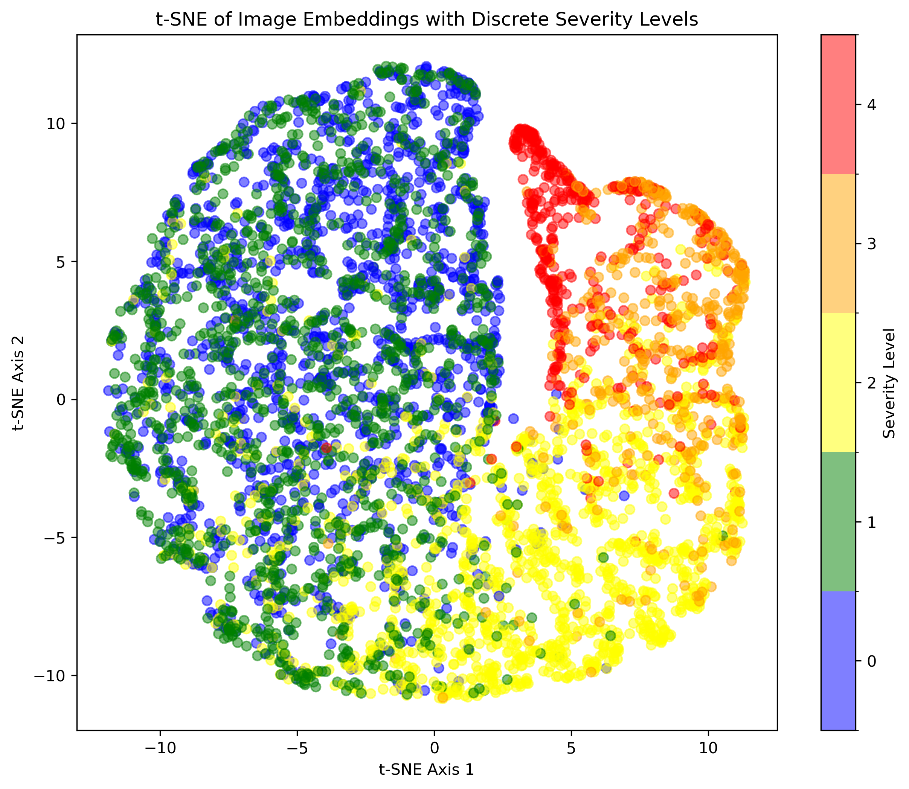

# Supervised Contrastive Learning for Diabetic Retinopathy Classification

This project explores the application of Supervised Contrastive Learning (SupCon) to the task of Diabetic Retinopathy (DR) severity grading. We compare the performance of a model trained with SupCon against a baseline model trained with standard supervised learning using cross-entropy loss.  The project utilizes transfer learning with a ResNet50 architecture and evaluates the quality of learned embeddings for both methods.  Furthermore, we demonstrate the utility of the learned embeddings for content-based image retrieval and severity ordering.

## Introduction

Diabetic Retinopathy is a leading cause of blindness, and accurate severity grading is crucial for timely intervention.  Traditional supervised learning methods have shown promising results, but we hypothesize that SupCon can improve performance by learning more robust and discriminative image representations.  This project compares two approaches:

1. **Standard Supervised Learning:** A ResNet50 model is trained using a standard cross-entropy loss.
2. **Supervised Contrastive Learning (SupCon):**  A ResNet50 model is trained using the SupCon loss. The model learns representations by contrasting augmented versions of images within the same class against images from other classes.  A linear classifier is then trained on top of the learned representations.

We compare the models' classification performance and analyze the quality of the learned embeddings using t-SNE visualizations and a downstream image retrieval task.

### Supervised Contrastive Learning

Traditional contrastive learning methods primarily focus on self-supervised learning, where the objective is to learn representations by contrasting different augmentations of the same image (positive pairs) against other images in the minibatch (negative pairs).  However, in supervised learning, we have access to class labels, offering the opportunity to leverage this information for contrastive learning.

SupCon addresses this by modifying the contrastive loss to consider all samples belonging to the same class as positive samples.  This encourages the model to learn representations where embeddings of the same class are clustered together, while those of different classes are pushed apart.

## Methodology

### Dataset

The project utilizes the Diabetic Retinopathy Detection dataset from Kaggle ([https://www.kaggle.com/competitions/diabetic-retinopathy-detection/data](https://www.kaggle.com/competitions/diabetic-retinopathy-detection/data)). The dataset contains retinal fundus images labeled with five severity levels of DR (0-4). The dataset has been preprocessed and a subset containing specified samples per class has been created for faster training purposes.

### Models

Both the baseline and SupCon models utilize a pre-trained ResNet50 architecture as the encoder.  For the baseline model, we replace the final fully connected layer to match the number of DR severity classes.  The SupCon model follows the architecture proposed by Khosla et al. [1], which includes a projection head after the encoder.

### Training and Evaluation

The baseline model is trained with standard cross-entropy loss. The SupCon model is trained using the supervised contrastive loss function as defined in [1]. After training, we evaluate the models on the test set to compare their classification performance. Model performance is evaluated using standard classification metrics, including accuracy, precision, and ROC AUC. We use 5-fold cross-validation to ensure robust evaluation.

We also visualize the learned embeddings using t-SNE to qualitatively assess their separability.  Finally, we use the trained SupCon model for content-based image retrieval and demonstrate a method for estimating the severity order of DR.

## Implementation Details

- `src/supcon.py`: Implements the SupCon model and loss function.
- `src/transforms.py`: Defines image transformations and augmentations.
- `src/utils.py`: Contains utility functions for data loading, embedding generation, t-SNE visualization, and other helper functions.
- `linear_classifier.py`: Trains a linear classifier on top of the frozen feature extractor (ResNet50 embeddings - both normal training and SupCon).
- `resnet_train.py`: Trains the baseline ResNet50 model.
- `supcon_train.py`: Trains the SupCon model.
- `test.py`: Evaluates a trained ResNet50 model.
- `image_retrieval_and_severity_order.ipynb`: Demonstrates image retrieval and severity ordering using the SupCon model.

## Results

### Classification Performance

| Model | Accuracy | AUC |
|---|---|---|
| Baseline | 0.583 | 0.799 |
| SupCon   | 0.601 | 0.835 |

### t-SNE Visualizations of Learned Embeddings

t-SNE plots provide a visual representation of the learned embeddings, showing how images from different DR severity levels are clustered in a 2D space.

- **Baseline Model Embeddings:**
  

- **SupCon Model Embeddings:**
  

### Image Retrieval Examples

## Future Work

- Explore different encoder architectures and projection heads.
- Experiment with different augmentation strategies.
- Evaluate the performance on a larger and more diverse dataset.
- Refine the method for severity ordering.

## References

[1] Khosla, Prannay, et al. "Supervised contrastive learning." Advances in Neural Information Processing Systems 33 (2020): 18661-18673.