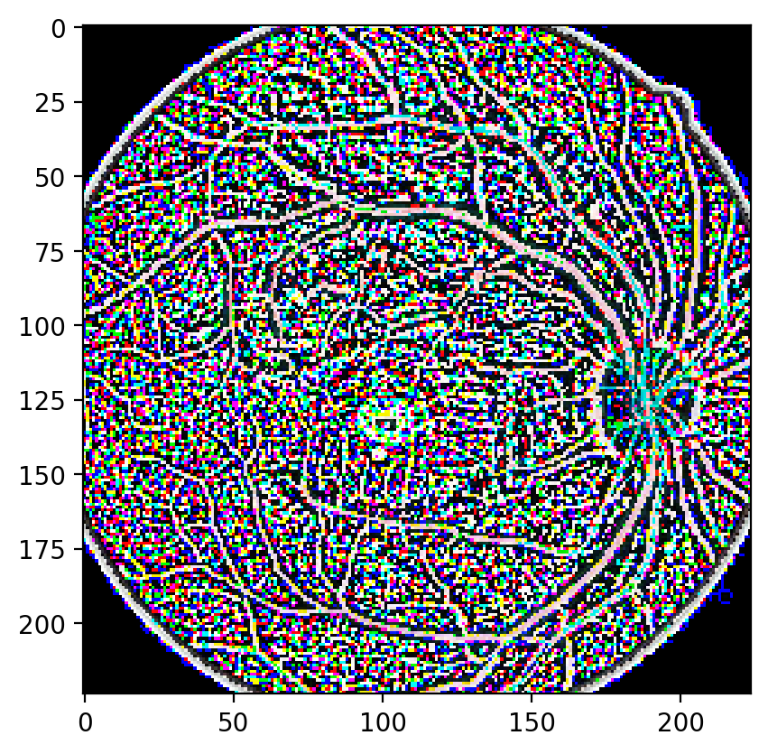
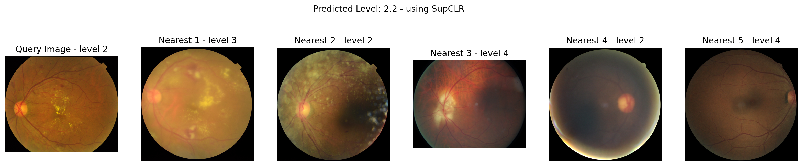
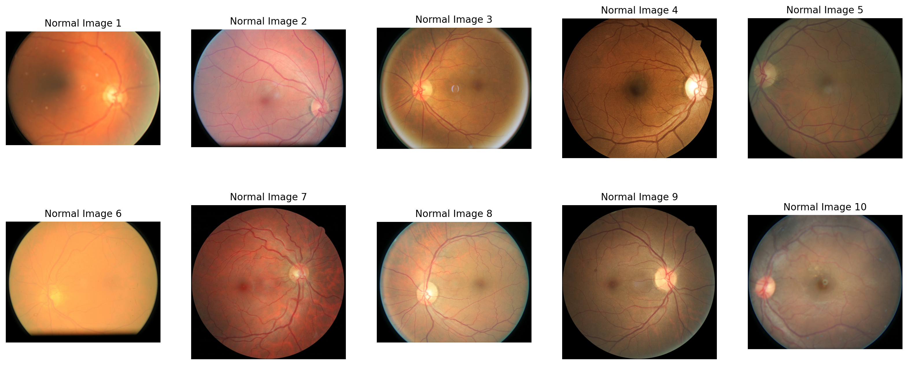
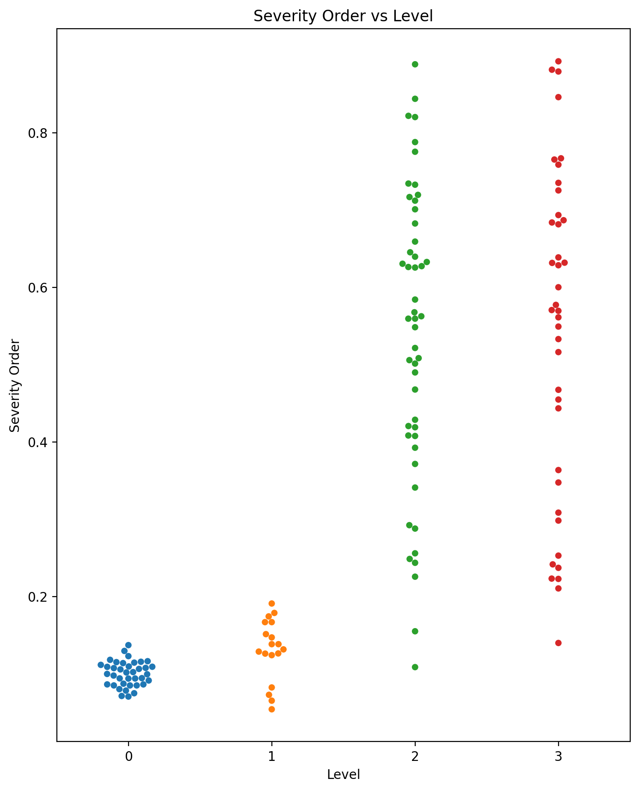

```python
from md_clr import *
from md_clr.supcon import *

import seaborn as sns
```

```python
CFG.epochs = 50
CFG.samples_per_class = 400
```

```python
device = torch.device(CFG.device)
```

```python
# train_data = pd.read_csv(os.path.join(DATA_FOLDER, 'trainLabels.csv'))
train_data = pd.read_csv(os.path.join(DATA_FOLDER, 'trainLabels_cropped.csv'))
train_data
```


<div>

<table border="1" class="dataframe">
  <thead>
    <tr style="text-align: right;">
      <th></th>
      <th>Unnamed: 0.1</th>
      <th>Unnamed: 0</th>
      <th>image</th>
      <th>level</th>
    </tr>
  </thead>
  <tbody>
    <tr>
      <th>0</th>
      <td>0</td>
      <td>0</td>
      <td>10_left</td>
      <td>0</td>
    </tr>
    <tr>
      <th>1</th>
      <td>1</td>
      <td>1</td>
      <td>10_right</td>
      <td>0</td>
    </tr>
    <tr>
      <th>2</th>
      <td>2</td>
      <td>2</td>
      <td>13_left</td>
      <td>0</td>
    </tr>
    <tr>
      <th>3</th>
      <td>3</td>
      <td>3</td>
      <td>13_right</td>
      <td>0</td>
    </tr>
    <tr>
      <th>4</th>
      <td>4</td>
      <td>4</td>
      <td>15_left</td>
      <td>1</td>
    </tr>
    <tr>
      <th>...</th>
      <td>...</td>
      <td>...</td>
      <td>...</td>
      <td>...</td>
    </tr>
    <tr>
      <th>35103</th>
      <td>35104</td>
      <td>35121</td>
      <td>44347_right</td>
      <td>0</td>
    </tr>
    <tr>
      <th>35104</th>
      <td>35105</td>
      <td>35122</td>
      <td>44348_left</td>
      <td>0</td>
    </tr>
    <tr>
      <th>35105</th>
      <td>35106</td>
      <td>35123</td>
      <td>44348_right</td>
      <td>0</td>
    </tr>
    <tr>
      <th>35106</th>
      <td>35107</td>
      <td>35124</td>
      <td>44349_left</td>
      <td>0</td>
    </tr>
    <tr>
      <th>35107</th>
      <td>35108</td>
      <td>35125</td>
      <td>44349_right</td>
      <td>1</td>
    </tr>
  </tbody>
</table>
<p>35108 rows × 4 columns</p>
</div>


```python
# remove all images from the csv if they are not in the folder
lst = map(lambda x: x[:-5], os.listdir(TRAIN_DATA_FOLDER))
train_data = train_data[train_data.image.isin(lst)].reset_index(drop=True)
train_data = train_data.groupby('level').head(CFG.samples_per_class).reset_index(drop=True)
len(train_data)
```


    2000


```python
# visualize the transformations
train_dataset = ImageTrainDataset(TRAIN_DATA_FOLDER, train_data, val_transforms)
image, label = train_dataset[15]
transformed_img_pil = func.to_pil_image(image)
plt.imshow(transformed_img_pil)
```


    <matplotlib.image.AxesImage at 0x7f42207cd750>


    

    


##### Note that the severity levels in test / query images are 0, 1, 2, 3 ie only 4 levels.
##### However the severity levels in train images are 0, 1, 2, 3, 4 ie 5 levels.

```python
os.listdir(TEST_DATA_FOLDER )
```


    ['DR2', 'Normal', 'DR3', 'DR1']


```python
# load model
model = SupConModel(timm.create_model(CFG.model_name, pretrained=True, num_classes=0))
model.load_state_dict(torch.load(OUTPUT_FOLDER + 'ckpt_epoch_8.pth'))
dataloader = DataLoader(train_dataset, batch_size=1, shuffle=False, num_workers=CFG.workers)
model.eval()
model = model.to(device)
```

```python
def convert_level(level):
    """
    converts training level to  query level
    """
    if level == 0:
        return 0
    else:
        return level * 3 / 4
```

## Retrieving Nearest Neighbours and Selecting Label Accordingly

```python
k = 5
```

```python
from sklearn.neighbors import NearestNeighbors

def get_all_embeddings(dataloader, model):
    with torch.no_grad():
        embeddings = []
        for image, _ in dataloader:
            image = image.to(device)
            output = model(image)       
            embeddings.append(output.cpu().numpy())
        
    return np.vstack(embeddings)


def get_nearest_images(query_img, dataloader, model, k=k):
    # Get embeddings for all images
    all_embeddings = get_all_embeddings(dataloader, model)

    # Query image (assuming it is loaded and transformed similarly)
    query_image = val_transforms(query_img).unsqueeze(0).to(device)  # Unsqueeze to add the batch dimension
    query_embedding = model(query_image).detach().cpu().numpy()

    # Find the k nearest images
    nbrs = NearestNeighbors(n_neighbors=k, algorithm='ball_tree').fit(all_embeddings)
    distances, indices = nbrs.kneighbors(query_embedding)

    # Resulting indices are the indices of the closest images in your dataset
    print(f"Indices of {k} nearest images:", indices[0])
    print("Levels of nearest images [0 - 4]:", [train_data.loc[idx].level for idx in indices[0]])
    print("Levels in query form [0 - 3]:", [convert_level(train_data.loc[idx].level) for idx in indices[0]])
    print("Distances:", distances[0])
    print("Mean distance:", np.mean(distances))
    print("Median distance:", np.median(distances))

    print ("----------------------------------------")
    print(f"Predicted Level [from 0 to 3]: {np.mean([convert_level(train_data.loc[idx].level) for idx in indices[0]]): .1f}")
    
    return indices
```

```python
# taking a random image from the DR 2 class
query_img = Image.open(TEST_DATA_FOLDER + '/DR2/1ffa93c6-8d87-11e8-9daf-6045cb817f5b..JPG')
indices = get_nearest_images(query_img, dataloader, model)
```

    Indices of 5 nearest images: [1764  396 1616  618 1790]
    Levels of nearest images [0 - 4]: [3, 2, 4, 2, 4]
    Levels in query form [0 - 3]: [2.25, 1.5, 3.0, 1.5, 3.0]
    Distances: [0.03625769 0.0473705  0.05601805 0.05613377 0.05806909]
    Mean distance: 0.05076981909666626
    Median distance: 0.056018046016168645
    ----------------------------------------
    Predicted Level [from 0 to 3]:  2.2


```python
# show the nearest images
fig, axs = plt.subplots(1, k+1, figsize=(20, 4))

# query image
axs[0].imshow(query_img)
axs[0].axis('off')
axs[0].set_title("Query Image - level 2")

for i, idx in enumerate(indices[0]):
    img = Image.open(TRAIN_DATA_FOLDER + train_data.loc[idx].image + ".jpeg")
    axs[i+1].imshow(img)
    axs[i+1].axis('off')
    axs[i+1].set_title(f"Nearest {i+1} - level {train_data.loc[idx].level}")
    
plt.suptitle('Predicted Level: 2.2 - using SupCLR')
```


    Text(0.5, 0.98, 'Predicted Level: 2.2 - using SupCLR')


    

    


## Disease Severity Order on a Continuous Spectrum

```python
# randomly sample 10 images from the train data folder

normal_images = list(train_data[train_data.level == 0].sample(10).image)
fig, axs = plt.subplots(2, 5, figsize=(20, 8))

axs = axs.ravel()

for i, img_name in enumerate(normal_images):
    img = Image.open(TRAIN_DATA_FOLDER + img_name + ".jpeg")
    axs[i].imshow(img)
    axs[i].axis('off')
    axs[i].set_title(f"Normal Image {i+1}")
```


    

    


```python
def get_embeddings(img, model):
    img = val_transforms(img).unsqueeze(0).to(device)
    output = model(img)
    return output

def get_severity_order(query_img, model, base_images):
    # median euclidean distance of the query image from the base images
    
    # Get embeddings for the query image and base images in a single batch
    query_embedding = get_embeddings(query_img, model)
    base_embeddings = torch.cat([get_embeddings(Image.open(TRAIN_DATA_FOLDER + img_name + ".jpeg"), model)
                                   for img_name in base_images])

    # Calculate pairwise distances using vectorized operations
    distances = torch.norm(query_embedding - base_embeddings, dim=1)

    # Get the median distance
    severity = torch.median(distances).item()

    return severity
```

```python
severity = get_severity_order(query_img, model, normal_images)
print(f'Order of severity of the disease: {severity:.2f}')
```

    Order of severity of the disease: 0.43


#### Note that this severity order is totally different from the levels we had in the dataset.

```python
# finding severity for all test images
severities = {'0': [], '1': [], '2': [], '3': []}

rel = {'0': 'Normal/', '1': 'DR1/', '2': 'DR2/', '3': 'DR3/'}

for level in rel:
    for img_name in os.listdir(TEST_DATA_FOLDER + rel[level]):
        img = Image.open(TEST_DATA_FOLDER + rel[level] + img_name)
        severity = get_severity_order(img, model, normal_images)
        severities[level].append(severity)
```

```python
# make a box plot for level vs predicted severity order
fig = plt.figure(figsize=(8, 10))
sns.swarmplot(data=[severities['0'], severities['1'], severities['2'], severities['3']])
plt.xlabel('Level')
plt.ylabel('Severity Order')
plt.title('Severity Order vs Level')
```
    Text(0.5, 1.0, 'Severity Order vs Level')


    

    


```python
plt.savefig(OUTPUT_FOLDER + 'severity_order_sup_con.png', dpi=300, bbox_inches='tight')
```


    <Figure size 1280x960 with 0 Axes>

